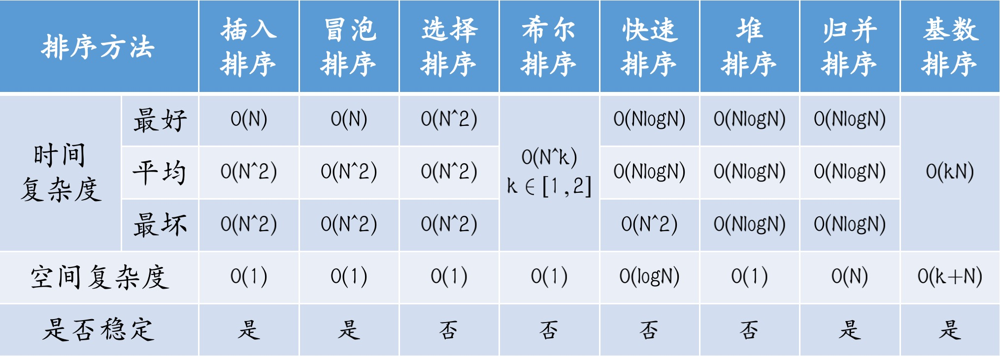

# 数据结构

**程序=算法+数据结构**

**数据结构=结构定义+结构操作**

## 时间复杂度

|复杂度 | 说明 | 例子🌰
|-|-|-
|`O(1)`| 常数 | 等差数列
|`O(logN)`| 对数 | 二分查找
|`O(n)`| 线性 | 一层 for 循环
|`O(nlogN)`| 线性对数 | 快速排序
|`O(n^2)`| 平方 | 两层 for 循环
|`O(n^3)`| 立方
|`O(n!)`| 阶乘
|`O(2n)`| 指数


## 空间复杂度

|复杂度 | 说明 | 例子🌰
|-|-|-
|`O(1)`| 常数 | 基本变量
|`O(n)`| 线性 | 一维数组
|`O(n^2)`| 平方 | 二维数组

## 线性表

### 前置知识

1. 指针：指向某元素的内存地址
2. 成员访问运算符的区别：“.” 与 “->”
3. 内存的分配与释放：内存管理系列函数
4. 参考手册：https://zh.cppreference.com/

### [顺序表](./3-1.vector.c)

线性表的顺序存储又叫做顺序表，他是由一组地址连续的存储单元依次存储线性表的数据元素，从而使得逻辑上相邻的两个元素，在物理位置上也相邻（数组）。

顺序表既可以静态分配空间，又可以动态分配空间。动态分配空间时，需要将 data 变为指针。


### [单链表](./4-1.list.c)

顺序表的链式存储又叫做链表，在链表中每个元素的内存空间不连续，中间使用指针连接。

通常用链表头节点(head)指针域链表长度来表示一个单链表。

### 双链表

指针域处理指向后一个元素的指针外(next)，还有指向前一个元素的指针(front)，这样的链表是双链表。

通常用链表的头节点指针、为节点指针与链表长度来表示一个双链表。
双链表与单链表操作上相似，只需在单链表的基础上额外操作指向前一个节点的指针即可。

### 循环链表

在单链表的基础上，最后一个元素的指针指向第一个元素的链表，就是循环链表。

循环链表在存储时，一般存储尾节点与双链表相似，还有双向循环链表。

### 顺序表与链表的对比

1. 存取方式不同，是否支持随机访问。
2. 插入、删除、查找操作不同。
3. 空间分配不同。


## 栈与队列

### [栈](./5-1.stack.c)

栈(stack)是一种只允许在一端进行插入或删除的线性表，他是一种先进后出（FILO）的数据结构。在栈不为空时，我们只能看到栈顶元素。

术语：入栈（压栈）、出栈（弹栈）、栈顶、栈底、

- 栈的结构定义
```C
#define MaxCnt 50 // 栈当中元素的最大个数
struct Stack { // 栈的定义
  EleType data[MaxCnt]; // 栈的数据域
  int top; // 栈顶元素的位置
}
```

与顺序栈相对应的，还有一种“[链栈](./5-2.stack_list.c)”，顾名思义，是使用类似于链表的结构实现的  
还有一种“共享栈”（也成为对顶栈）：两个栈共享同一片内存空间。


### 队列

队列（Queue）是一种只允许在一端进行插入，在另一段进行删除的线性表，他是一种先进先出（FIFO）的数据结构。  
在队列不为空时，（一般的）我们只能看到队首元素。

术语：出队、入队、队首、队尾、队首元素、队尾元素、队列

- 队列的结构定义
```C
#define MaxCnt 50 // 队列当中元素的最大个数
struct Queue { // 队列定义
  EleType data[MaxCnt]; // 队列的数据域
  int front,back; // 队首元素与队尾元素的位置
}
```

由于普通的队列在入队出队的过程汇总指针的位置可能超过数据范围上限，所以一般在实现时使用循环队列。  
当指针指向上限时将这阵移动到最开始，与栈类似，也可以用链表的结果实现链式队列。


### 栈与队列复杂度对比

|栈 | 队列 |
|-|-|
|入栈 `O(1)` | 入队 `O(1)`
|出栈 `O(1)` | 出队 `O(1)`
|栈顶 `O(1)` | 队首 `O(1)`


## 树与二叉树

- 树节点的结构定义
```c
struct Node { // 树的结构定义
  EleType data; // 树节点的数据结构
  Node *child[]; // 子节点指针集合
}
```

对于子节点指针，有可能用数组是实现也有可能用链表是吸纳。  
树还可以用数组实现，只需记录每个节点的父节点即可。  

- 树的基本术语
  1. 父节点、子节点、兄弟节点、祖先、子孙
  2. 节点的度、树的度
  3. 叶子节点（终端节点）与分支节点（非终端节点）
  4. 节点的深度，高度和层次
  5. 路径与路径长度


## 森林与并查集

### 森林

> 树的集合是森林

#### 二叉树

> 有两个节点，左节点和右节点

- 二叉树中节点的结构定义
```C
struct Node { // 二叉树节点的定义
  EleType data; // 二叉树节点的数据域
  Node *left_child, *right_child; // 左子节点与右子节点指针
}
```

左子树与右子树也经常写作left(lchild)和 right(rchild) 同理二叉树也可以使用数组来存储

- 二叉树的基本术语
  1. 左孩子（左子树），右孩子（右子树）
  2. 每层的节点个数
  3. 满二叉树，完全二叉树
  4. 使用一维数组存储二叉树
  5. 广义表

- 二叉树的遍历
  - 深度搜索（递归）
    1. 先序遍历(树根->左子树->右子树)
    2. 中序遍历(左子树->树根->右子树)
    3. 后序遍历(左子树->右子树->树根)
  - 广度搜索（队列）  
    4. 层序遍历
  5. 根据遍历还原树

- 二叉树线索化
> 左前驱（ltag），右后继（rtag）

- 树与二叉树的转换
> 左孩子，右兄弟
树与二叉树的的先序遍历和中序遍历后的顺序是一致的。

- 二叉排序树（二叉查找树、二叉搜索树、BST 树）  
如果一课二叉树中的任意节点均满足，它左子树上所有的节点值都小于自身，它右子树上的所有节点都大于自身，那么这棵树即为二叉树。

- 哈夫曼树

给定 N 个权值作为 N 个叶子节点，构造一颗二叉树 带权路径长度（所有分支节点和根节点加在一起） 最小的二叉树称为哈夫曼树。  

构造方法为，每次选出两个权值最小的节点进行合并，将合并后的点放回后，重复上述过程，知道最终剩余一个节点作为根树。

- 哈夫曼编码

对于哈夫曼树中的叶子节点，从根节点出发向左子树移动编码为0，向右子树移动编码为 1 到达自身的所有路径连接起来即为该叶子节点的编码。


## 森林与并查集

### 森林

树的集合称为森林，树的根节点都是兄弟，其他子节点遵循左孩子右兄弟原则。

### [并查集](./8-1.union_set.c)

并查集就是多个集合，一个集合就是一棵树，树先用一维数组演示。

并查集有两个功能：合并、查询。


## 排序



### 插入类的排序

- [直接插入排序](./9-1.insert_sort.c)

将待排序区的第一个元素通过大小比较，直接插入到已排序区的指定位置，使得已排序元素数量加一，不断重复此过程，直到所有元素均已排序。

时间复杂度：O(n^2)，空间复杂度：O(1)，稳定性：两个相同元素排序后所在的位置是否一致(是)

- 折半插入排序

与直接插入排序类似，只是在寻找元素插入位置时改用折半查找法进行查找。

- 希尔排序

根据不同的增量，将数据分组。对于每组数据，分别进行直接插入排序。然后缩小增量，重复这个过程。最终当增量为 1 时，相当于进行了直接插入排序。这轮排序后，数据整体有序。

时间复杂度：O(n^k)， 空间复杂度：O(1)，稳定性：否

### 交换类的排序


- [冒泡排序（起泡排序，泡排序）](./9-2.bubble_sort.c)

两两比较相邻的元素。如果不满足大小关系，就交换它们。遍历一轮序列后，最值元素就会被交换到最后。重复上述过程，直到所有元素均有序。

若某一轮遍历没有触发任何交换。则此时序列已经有序，可以提前结束排序。

时间复杂度：好 O(n) 平均 O(n^2) 坏 O(n^2)，空间复杂度：O(1)，稳定性：是


- [快速排序](./9-3.quick_sort.c)

选择一个枢纽元素作为中间值。一轮排序将所有中间值的元素放到中间值左面。将所有大于中间值的元素放到中间值右面。接下来对左边和右边重复上述过程，直到整体序列有序。

时间复杂度：好 O(nlogN) 平均 O(nlogN) 坏 O(n^2)，空间复杂度：O(logN)，稳定性：否


### 选择类的排序

- [选择排序](./9-4.select_sort.c)

在待排序区间内找到一个最值元素，与待排序区间的第一个元素进行交换，使得已排序区间加一。重复上述过程，最终整个序列有序。

时间复杂度：O(n^2)，空间复杂度：O(1)，稳定性：否

- 堆排序（优先队列）

> 大顶堆（数大的在上面）、小顶堆（数小的在上面）

堆（优先队列）是一个用数组模拟的完全二叉树。在堆排序时，分为建堆与排序两个部分。其中建堆部分的复杂度为 O(n)，排序是相当于不断删除堆顶元素（极值元素）放到待排序序列的最后，最终使得序列有序。

入队：O(logN)  
出队：O(logN)  
堆顶元素： O(1)  

- 归并排序

将待排序区间分为左区间和右区间，对两个区间分别镜像归并排序。在两个区间有序后，对两个区间进行合并，最终使得整体有序。

时间复杂度：O(nlogN)，空间复杂度：O(N)，稳定性：是

- 基数排序

将待排序序列组织进不同的桶当中，再按照桶的顺序将元素拿出经过 k 轮操作后，序列整体有序。

时间复杂度：O(Kn)，空间复杂度：O(L+N)，稳定性：是


## 查找

### 线性查找

- 顺序查找

按照某种顺序一次遍历线性表中的每一个元素进行查找。

- 折半查找（二分查找）

利用待查找序列的**有序性**，一次找到一半不存在答案的待查找区间。

时间复杂度：O(logN)

- 分块查找

同一块待查找序列可以无序，所有区块之间有序（不绝对）。

### 树形查找

- 二叉查找树（二叉排序树、二叉搜索树、BST）

时间复杂度：好 O(logN) 坏 O(n)

- 平衡二叉树（AVL 树）

因为二叉排序树的性质过于简单，在最坏的情况下会退化成链表，使得效率极差。所以引入了平衡二叉树的概念，对于平衡二叉树来说，每个简单的**平衡因子只能是-1,0,1 三数之一**。

**平衡因子 = 左子树的高度-右子树的高度**

由于有平衡因子的存在，所以在插入元素和删除元素时，需要进行平衡性的调整。

AVL 树：左旋、右旋。（LL、RR、LR、RL）

- B 树（多路平衡查找树）

m 阶 B 树向上取整：（$\lceil \rceil$为向上取整）

1. 除根节点外，每个节点的关键字个数最少为 $\lceil m/2 \rceil$-1
2. 每个节点的关键字个数最多为 m-1
3. 除根节点外，每个节点的子树最少为 $\lceil m/2 \rceil$ 棵
4. 每个节点的子树最多为 m 棵
5. 最下一层的节点为叶子节点，不存储任何信息

- B+ 树

1. B+树是没有根节点的
2. B+树的节点之间是有连接的

